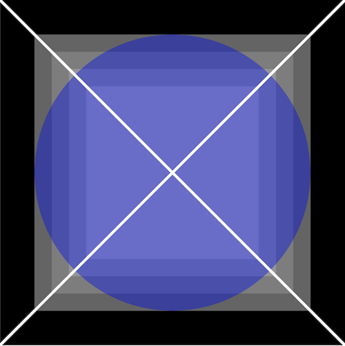

### Activity / CART 253 / Fall 2018 / Pippin Barr

# Basic drawing

---

## Reproduce the following image on a 500x500 canvas



---

## Solution

See presenter notes.

???

```javascript
function setup() {
  // Create the canvas to the required size
  createCanvas(500,500);

  // A black background
  background(0);

  // Three concentric squares with a (manual) gradient of fills
  rectMode(CENTER);
  noStroke();
  fill(100);
  rect(250,250,400,400);
  fill(125);
  rect(250,250,350,350);
  fill(150);
  rect(250,250,300,300);
  fill(175);
  rect(250,250,250,250);

  // A transparent blue circle over the top
  fill(0,0,255,100);
  ellipse(250,250,400,400);

  // An X over the canvas in thick white
  stroke(255);
  strokeWeight(4);
  line(0,0,500,500);
  line(0,500,500,0);
}
```
