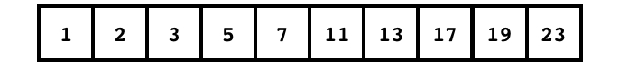
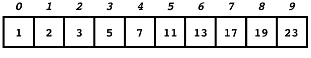

### Core / CART 253 / Fall 2018 / Pippin Barr

# Arrays

---

## In this module

- The final piece of totally new syntax!
- Numbered boxes with stuff in them

???

- The final piece of syntax! Amazing!
- After this there are no new special characters or anything to learn
- Also the last really fundamental concept in programming for us
- Also incredibly useful

---

## One ball, two balls, three balls, one hundred balls?

- Our Pong code lets us easily make new Ball objects by creating new ones in variables, and then updating and displaying them
- But if we wanted one hundred of them, it's going to get annoying...

```javascript
ball1 = new Ball(10,10,2,2,10,2);
ball2 = new Ball(20,10,2,2,10,2);
ball3 = new Ball(30,10,2,2,10,2);
ball4 = new Ball(40,10,2,2,10,2);
...
ball99 = new Ball(990,10,2,2,10,2);
ball100 = new Ball(1000,10,2,2,10,2);
```

---

## Worserer and worserer...

```javascript
function draw() {
  ball1.update();
  ball2.update();
  ball3.update();
  ...
  ball99.update();
  ball100.update();

  ball1.display();
  ball2.display();
  ball3.display();
  ...
  ball99.display();
  ball100.display();
}
```

---

## We know (part of) the solution to this!

- What kind of thing can we use if we need to __repeat__ the same action over and over again in a program?
--

- A loop!
--

- So we want to be able to do something like...

```javascript
for (var i = 0; i < 100; i++) {
  ball number i = new Ball(10*i,10,2,2,10,2);
}
```
--

- Buuuuut, that doesn't work. Because we can't just say `ball number i` like this

---

## We need something new...

- What we need is a way to keep track of a a whole __set__ of similar things, instead of just one thing per one variable
- Ideally we could have a variable that would store __all__ of our Balls in it for example
- And we could just refer to __which one we want__ when we're dealing with them
- And ideally we could use a __loop__ to go through all the elements in the set

???

- Note that we __have__ seen something a bit like this with Objects - they can store a bunch of different information in a single variable, but they're a bit __too powerful__ for what we want here. An object can store many __different__ kinds of values in it, associated with __property names__. Whereas what we want now is just to store a number of the same thing together. An object can do this, but there's an easier/better way...

---

## Arrays!

- Unsurprisingly, given today's topic, __arrays__ are the solution to this problem
- An array is basically __set of numbered boxes__ that you can store values in
- And we can __store an entire array in a single variable__ (it's another kind of value)
- So a variable with an array in it can store __multiple values__
- This is obviously mostly useful when all the values are __related to each other__

???

- Actually an array in JavaScript is an __Object__, it just has some special syntax because it's so fundamental to programming in many, many programming languages

---

## An array of numbers

```javascript
var numbers = [];
```

- This is some of our new syntax
- This creates an __empty array__ by using __empty square brackets__
- In this case we'll store numbers in this array (hence the name)
- Let's break it down...

???

- Note that like with variables, JavaScript doesn't check what __type__ of thing you put in an array, so you __could__ store some numbers, some truth values, some objects, etc. all in the __same array__, but you should probably afunction it.

---

## An array of numbers

```javascript
var numbers = [];
```

- First we have .hi[`var`]
- Because we store arrays in __variables__ like any other value

---

## An array of numbers

```javascript
var numbers = [];
```

- Next we have .hi[`numbers`]
- This is the variable name, just like any variable name
- This is the variable that will __contain__ the array we're declaring
- Given that arrays contain multiple values, you often end up using a __plural__ for the array name

---

## An array of numbers

```javascript
var numbers = [];
```

- Now we have .hi[`=`]
- We're going to __assign__ our variable with an array

---

## An array of numbers

```javascript
var numbers = [];
```

- Then we get .hi[`[]`]
- These empty square brackets are an __empty array__
- (That's why they're empty.)

---

## An array of numbers

```javascript
var numbers = [];
```

- Finally we have .hi[`;`]
- Just because.

---

## An array of numbers

```javascript
var numbers = [];
```

- So this line creates a new empty array, and puts that array into the variable called `numbers`

---

## An array of actual numbers, though...

- We can also create a new array with numbers __already in it__ like this:

```javascript
var numbers = [1, 2, 3, 5, 7, 11, 13, 17, 19, 23];
```

- That is, we __list__ the numbers the array should have in it inside the square brackets, separated by commas. We can imagine something like this;



- Notice how the __order__ of numbers we started the array with __matters__
- (They don't have to be in numeric order, rather they get stored in order in the array from left to right.)

---

## How do I get at them numbers?

```javascript
var numbers = [1, 2, 3, 5, 7, 11, 13, 17, 19, 23];
```

- It's great that we now have all these (prime) numbers stored in an array, but how can we do anything with them?
--

- The boxes in the array (called __elements__) are __numbered__ (from __zero__!)
- Those numbers are called __array indexes__ (or just __indexes__)



---

```javascript
var numbers = [1, 2, 3, 5, 7, 11, 13, 17, 19, 23];
```


- So if I wanted to get to the __value__ `7` I would look at __index__...
--
 `4`
--

- And if I wanted to get to the __value__ `23` I would look at __index__...
--
 `9`
--

- And if I looked at the element at __index__ `5` I would see the __value__...
--
 `11`
--

- And if I looked at the element at __index__ `7` I would see the __value__...
--
 `17`

---

## In code now...

- We can get an element in an array using those square brackets again
- So if I want the __value at index__ `5` I would write

```javascript
numbers[5]
```

- Which is which one?


---

## In code now...

- We can refer to element in an array using those square brackets again
- So if I want to refer to the __value at index__ `5` I would write

```javascript
arrayOfIntegers[5]
```

- Which is which one? Right.


---

## Individual array elements are like variables

- We can use these references to array elements like any other variable
- So `numbers[5]` means "the value at index 5", which is a number, and we can use it like any number
- Which means we can use it in conditionals, or as an argument, or anything else...
- Importantly, we can also store an number in it, which might be the results of a calculation...
- So basically `numbers[5]` is like a __variable__

---

## Array elements are like variables

```javascript
var numbers = [1, 2, 3, 5, 7, 11, 13, 17, 19, 23];

console.log(numbers[5]);
```

Gives us `11`

---

## Array elements are like variables

```javascript
var numbers = [1, 2, 3, 5, 7, 11, 13, 17, 19, 23];

if (numbers[2] < numbers[3]) {
  console.log("Element at index 2 is less than element at index 3");
}
else {
  console.log("Element at index 2 is greater than element at index 3");
}
```

- So we will see...
--
 `Element at index 2 is less that element at index 3`

---

## Array elements are like variables

```javascript
var numbers = [1, 2, 3, 5, 7, 11, 13, 17, 19, 23];

numbers[2] = numbers[2] * numbers[4];

if (numbers[2] < numbers[3]) {
  console.log("Element at index 2 is less than element at index 3");
}
else {
  console.log("Element at index 2 is greater than element at index 3");
}
```

- So we will see...
--
`Element at index 2 is greater than element at index 3`

???

- Because `numbers[2]` starts `3` and `numbers[4]` is `7`
- So `numbers[2] * numbers[4]` is `21`
- Which is put back into `numbers[2]`
- Which is therefore greater than the value in `numbers[3]`, which is `5`

---

## Another way of setting the values of an array

- So we could also set up the same `numbers` like this

```javascript
var numbers = [];

numbers[0] = 1;
numbers[1] = 2;
numbers[2] = 3;
numbers[3] = 5;
numbers[4] = 7;
numbers[5] = 11;
numbers[6] = 13;
numbers[7] = 17;
numbers[8] = 19;
numbers[9] = 23;
```

- Maybe a bit less convenient than the other way, but useful to know

---

## Arrays can store any kind of value in them!

```javascript
var arrayOfFloats = [3.14159, 1.222222, 1.01];

var songLyrics = ["This", "is", "the", "song", "that", "doesn't", "end"];

var backgroundColors = [color(255,0,0), color(0,255,0), color(0,0,255)];

var images = [loadImage("image1.png"),loadImage("image2.png"),loadImage("image3.png")];
```

---

## Arrays can store objects in them!

```javascript
var balls = [
  new Ball(10,10,2,2,10,2),
  new Ball(20,10,2,2,10,2),
  new Ball(30,10,2,2,10,2),
  new Ball(40,10,2,2,10,2)
];
```

- Note that you can declare an array like the above with each element of the array on a new line, which can make your code more readable. Compare that to:

```javascript
var balls = [new Ball(10,10,2,2,10,2),new Ball(20,10,2,2,10,2),new Ball(30,10,2,2,10,2),new Ball(40,10,2,2,10,2)];
```

---

## Array of Balls "improved"

- We can now create an array of Balls instead of individual variables...

```javascript
var balls = [];
balls[0] = new Ball(10,10,2,2,10,2);
balls[1] = new Ball(20,10,2,2,10,2);
balls[2] = new Ball(30,10,2,2,10,2);
...
balls[99] = new Ball(1000,10,2,2,10,2);
```
--

- But it's not great
- Because we're still creating each ball individually and specifically to put it in the array

---

## `push()` and arrays

- Another way to add something into an array in JavaScript is with `push()`
- We use it like this:

```javascript
var balls = [];
balls.push(new Ball(10,10,2,2,10,2));
balls.push(new Ball(20,10,2,2,10,2));
balls.push(new Ball(30,10,2,2,10,2));
```

- This starts with an empty array and then adds new Ball objects into it one by one
- Each new ball is added to the __end__ of the array
- It's kind of nice because we don't need to worry about which number we're up to now, so we're less likely to make a mistake with that...

---

## 100 Balls!

```javascript
var balls = [];

balls.push(new Ball(10,10,2,2,10,2));
balls.push(new Ball(20,20,2,2,10,2));
balls.push(new Ball(30,30,2,2,10,2));
balls.push(new Ball(40,30,2,2,10,2));
balls.push(new Ball(50,30,2,2,10,2));
...
balls.push(new Ball(990,30,2,2,10,2));
balls.push(new Ball(1000,30,2,2,10,2));
```
--

- Oh no! This still sucks in the same way! What can we do?
--

- Oh yeah! The loop idea we had earlier!

---

## 100 Balls with a `for` loop!

```javascript
var balls = [];

for (var i = 0; i < 100; i++) {
  balls.push(new Ball(10*i,10,2,2,10,2));
}
```

- Damn that's good.
- Each Ball is created using the iterator `i` for its position to recreate the idea of them being positioned differently, and then pushed into the array.
- This recreates the code we'd been writing before, but with three lines instead of 100!

---

## 100 Balls with a `for` loop!

```javascript
var balls = [];

for (var i = 0; i < 100; i++) {
  balls.push(new Ball(random(0,width),random(0,height),2,2,10,2));
}
```

- We don't __have to__ use `i` inside a `for` loop
- We can just place balls in random locations for instance
- Or with random velocities...

```javascript
var balls = [];

for (var i = 0; i < 100; i++) {
  balls.push(width/2,height/2,random(-5,5),random(-2,2),10,5));
}
```

---

## 100 Balls bouncing

- We can use this `for`-looping through an array trick __everywhere__

```javascript
function draw() {
  for (var i = 0; i < 100; i++) {
    balls[i].update();
    balls[i].display();
  }
}
```

---

## .length

- Rather than needing to __know__ the number of things in an array (like that there are 100 Ball objects), every array has a `length` property that tells you
- So a better version of the previous loop would actually be

```javascript
function draw() {
  for (var i = 0; i < balls.length; i++) {
    balls[i].update();
    balls[i].display();
  }
}
```

- This is a __totally classic__ `for` loop with an array
- You will do this so many times in your life
- And you will think of me

---

## Multiball action?!

- Let's edit the Pong code to have 100 balls!??!?!?!

???

- We'd need to update `setup()` to create 100 balls to begin with
- And we'd need to update all the methods called in our `draw()` loop to use the `for` loop through the array of `balls`

```javascript
var balls = [];
var numBalls = 100;

function setup() {
    createCanvas(640,480);
    for (var i = 0; i < numBalls; i++) {
      balls.push(new Ball(width/2,height/2,random(-5,5),random(-5,5),10,5));
    }
    rightPaddle = new Paddle(width-10,height/2,10,60,10,DOWN_ARROW,UP_ARROW);
    leftPaddle = new Paddle(0,height/2,10,60,10,83,87);
}

function draw() {
  background(0);

  leftPaddle.handleInput();
  rightPaddle.handleInput();

  leftPaddle.update();
  rightPaddle.update();

  for (var i = 0; i < balls.length; i++) {
    balls[i].update();
    if (balls[i].isOffScreen()) {
      balls[i].reset();
    }
    balls[i].handleCollision(leftPaddle);
    balls[i].handleCollision(rightPaddle);
    balls[i].display();
  }

  leftPaddle.display();
  rightPaddle.display();
}
```

---

## Addendum: `console.log()` and arrays

- `console.log()` is excellent for printing out the values in an array, which is very helpful for debugging
- As in:

```javascript
var array = [1,2,9,2,5,7,4,23,2];
console.log(array);
```

- If you look at the output in the JavaScript console, you'll see the values in the array nicely printed out
- If you click the little arrow next to the array name in the console, you can display the whole array element by element, too
- If you have more complex elements in the array (like objects), clicking the arrow will show much more detailed views of the objects

---

# Fin.
