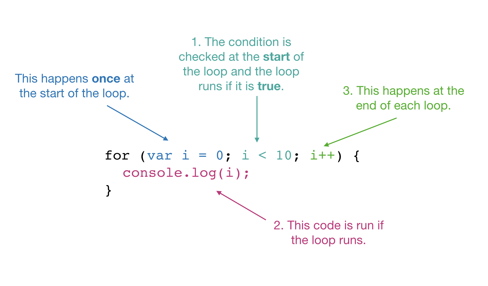

### Core / CART 253 / Fall 2018 / Pippin Barr

# For loops

---

## In this module

- Loops `for` counting
- The Terminator

---

## Bean counting

- In programming, a lot of the time what we want to do with a loop is to perform some action a __set number of times__
- Basically we want the program to count up to some number, doing an action with each count
- There is a special kind of loop syntax for exactly this situation
- It's called a `for` loop

---

## `for` what it's worth...

```javascript
for (let i = 0; i < 10; i++) {
  console.log(i);
}
```

- This `for` loop counts from `0` to `9` in the variable `i` and prints out the value of `i` each time
- So we will see 0, 1, 2, 3... etc.
- Let's look at this syntax...

---

## `for` what it's worth...

```javascript
for (let i = 0; i < 10; i++) {
  console.log(i);
}
```

- First we have the word .hi[`for`]
- It means, "this is a `for` loop"
- We're deeply familiar with this idea now, a special word for a special effect

---

## `for` what it's worth...

```javascript
for (let i = 0; i < 10; i++) {
  console.log(i);
}
```

- Next we have .hi[`( ... )`], a set of parenthesis around some information
- We know from other examples that this means "here is the information needed to do this"
- Unlike a `while` loop we give __three pieces of information__ in here

---

## `for` what it's worth...

```javascript
for (let i = 0; i < 10; i++) {
  console.log(i);
}
```

- The first part of the information here is .hi[`let i = 0`]
- This is the __starting condition__ of our loop
- In this case we're setting up a __counting variable__ (or __iterator__) that will count the times we've gone through the loop
- Calling it `i` is very traditional
- This happens __once__ at the very beginning of the loop

---

## `for` what it's worth...

```javascript
for (let i = 0; i < 10; i++) {
  console.log(i);
}
```

- Now we have .hi[`;`] to signal we're moving to the next piece of information
- Which is annoying, because normally we separate information with commas!
- But in a `for` loop we separate with semicolons
- So be it

---

## `for` what it's worth...

```javascript
for (let i = 0; i < 10; i++) {
  console.log(i);
}
```

- Now we see .hi[`i < 10`]
- This is the __condition__ for this `for` loop
- While the condition is `true` the `for` loop keeps going, once it's `false` the `for` loop ends
- This is __checked at the start of the loop every time through__
- This is just like the condition in a `while` loop

---

## `for` what it's worth...

```javascript
for (let i = 0; i < 10; i++) {
  console.log(i);
}
```

- Then we get .hi[`;`]
- Another day, another semicolon

---

## `for` what it's worth...

```javascript
for (let i = 0; i < 10; i++) {
  console.log(i);
}
```

- And now our third piece of information is .hi[`i++`], it means "add `1` to `i`"
- This is the __updating__ step that will run at the __end__ of the loop each time
- In this case we are adding `1` to `i` each time through the loop
- So the first time `i` is `0`, then it's `1`, then it's `2`, and so on
- Adding `1` is the most common update step by far

---

## `for` what it's worth...

```javascript
for (let i = 0; i < 10; i++) {
  console.log(i);
}
```

- Finally, we have .hi[`{ ... }`], our curly brackets
- Inside the brackets is the action we want to do over and over in the loop, in this case to print the value of `i`
- As always, you can put __as many lines of code as you want__ inside the curly brackets
- And as always, you should __make sure they match__

---



---

## Other `for`age

```javascript
for (let i = 0; i < 10; i += 2) {

}

for (let i = 10; i > 0; i--) {

}

for (let i = 0; i <= 100; i += 10) {

}
```

- And so on
- You can do whatever you want so long as you have a start condition, and end condition, and some useful update statement!
- You are __most likely__ to count up by one

---

## `for === while`

```javascript
let i = 0;
while (i < 10) {
  console.log(i);
  i++;
}
```

```javascript
for (let i = 0; i < 10; i++) {
  console.log(i);
}
```

- These are exactly the same thing
- `for` is just a bit shorter to write for the specific situation of __counting__
- People often prefer it in these situations and you'll see it a lot

???

- Later, when we get to __arrays__ you'll see `for` loops doing this counting job a lot

---

## Draw that caterpillar with `for`!

```javascript
let startX;
let startY;
let segmentRadius = 20;
let numSegments = 10;

function setup() {
  createCanvas(640,480);
  noStroke();
  fill(80,200,80);
  startX = width/5;
  startY = height/2;
}

function draw() {
  background(200,250,200);
  let segmentsDrawn = 0;
  let x = startX;
  for (let i = 0; i < numSegments; i++) {
    ellipse(x,startY,segmentRadius*2);
    x += segmentRadius * 1.5;
  }
}
```

???

- Exactly the same as the `while` version

---

## Star field with `for`

```javascript
let numStars = 1000;

function setup() {
  createCanvas(500,500);
  background(0);

  for (let i = 0; i < numStars; i++) {
    let x = random(0,width);
    let y = random(0,height);
    let starSize = random(1,2);
    stroke(random(100,255));
    rect(x,y,starSize,starSize);
  }
}

function draw() {

}
```

---

## Loops!

- Again, loops are all about getting the computer to do the heavy lifting when it comes to repetitive instructions
- `for` loops and `while` loops are equivalent to one another
- You will most often see `for` loops when it's simply a matter of counting up (or down) in set increments
- `while` loops are often used more like repeating `if` statements that, for example, keep adjusting a value until it's in the right range, or doing something until a more complex condition occurs than just a count

---

## Food for thought

- Loops reveal a kind of scary, Terminator-like aspect of computation
- The program is prepared to go on forever, until the end of the world, _it will not be stopped_
- If you say, "Hey, JavaScript, let's print all the numbers starting from zero, one each frame", then JavaScript will go ahead and do that
- Until you die.

---

```javascript
let counter = 0;

function setup() {
  createCanvas(1000,500);
  fill(255);
  stroke(255);
  textSize(100);
  textAlign(CENTER,CENTER);
  textFont("Helvetica");
}

function draw() {
  background(0);
  text("You are\n" + counter + "\nframes closer to your death.",width/2,height/2);
  counter++;
}

```

???

- Here is some code to keep you company...
- ... FOREVER!!
- (Although the variable `counter` will also reach its maximum value at a certain point and roll over... but that will take a while.)
- Note of course that this is using the `draw()` loop rather than `while` or `for` because we want the looping thing (the `counter` going up) to take place over time

---

# Fin.
