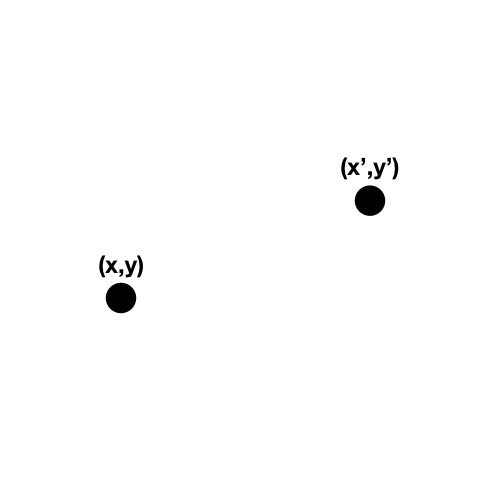
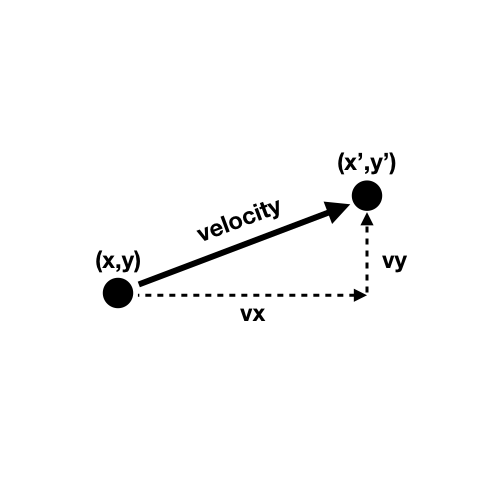
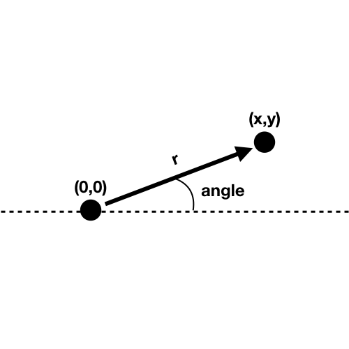
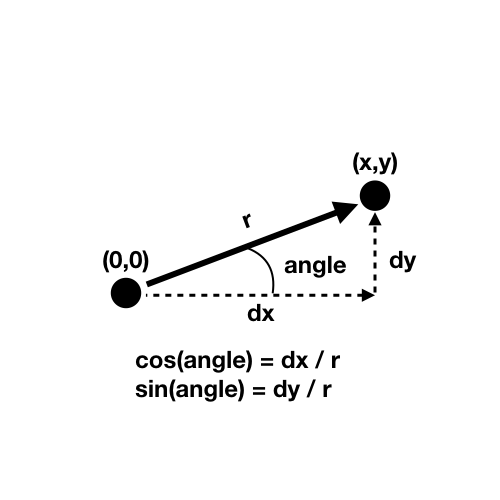
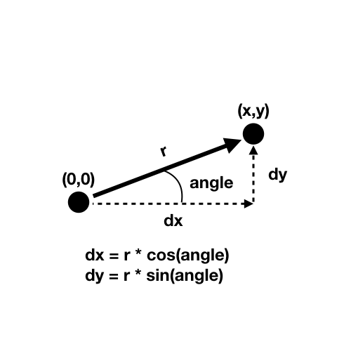
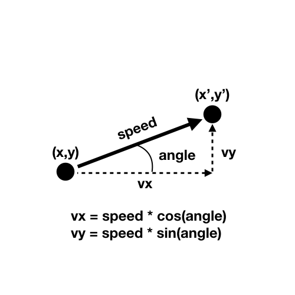

### Physics / CART 253 / Fall 2018 / Pippin Barr

# Polar coordinates and velocity

---

## In this module

- Positions on the Cartesian plane
- Velocity on the Cartesian plane
- Polar coordinates to represent velocity
- A spaceship!

---

## Positions on the Cartesian plane

- To this point we've dealt with velocity in terms of the Cartesian plane
- That is, we always think about positions on the canvas in terms of an `x` and `y` position (in pixels)

---

## Positions on the Cartesian plane



---

## Velocity on the Cartesian plane

- Velocity modifies a position by adding a `vx` and `vy`, representing movement with velocity
- So an object, for instance, can move between `x,y` and `x',y'` by adding the velocity

---

## Velocity on the Cartesian plane



---

## Polar coordinates

- A __different__ way to represent a point on the Cartesian plane is with __polar coordinates__
- Polar coordinates specify a point as (r,angle)
- Where __r__ is the length of the radius outward from the origin
- And __angle__ is the angle the radius makes with the horizontal (anticlockwise)
- This can be really useful if we're wanting to describe movement in terms of __directions__ instead of split between the `x` and `y` components

---

## Polar coordinates



---

## Polar to Cartesian

- We can __convert__ from our polar coordinates representation to a standard `x` and `y` representation
- This is useful because `x` and `y` are basically how our canvas/screen is "really" set up
- To do this we need to use... __trigonometry__!
- Finally. A use for trigonometry.

---

## Polar to Cartesian



---

## Polar to Cartesian



---

## Using polar for velocity!

- Given that we can convert between a polar coordinates representation and a cartesian representation...
- ... we can use this to represent velocity in terms of angle and speed, and convert back to Cartesian when we need to actually display it on the screen!

---

## Using polar for velocity!



---

## "Simple" Spaceship!

__See presenter notes__

???

```javascript
let ship = {
  angle: 0,
  speed: 0,
  x: 0,
  y: 0,
}

function setup() {
  createCanvas(500,500);
  ship.x = width/2;
  ship.y = height/2;
}

function draw() {
  handleInput();
  moveShip();
  drawShip();
}

function handleInput() {
  if (keyIsDown(LEFT_ARROW)) {
    ship.angle -= 0.1;
  }
  else if (keyIsDown(RIGHT_ARROW)) {
    ship.angle += 0.1;
  }

  if (keyIsDown(UP_ARROW)) {
    ship.speed = 5;
  }
  else if (keyIsDown(DOWN_ARROW)) {
    ship.speed = 0;
  }
}

function moveShip() {
  // The magic lines for calculating velocity!
  let vx = ship.speed * cos(ship.angle);
  let vy = ship.speed * sin(ship.angle);

  ship.x += vx;
  ship.y += vy;
}

function drawShip() {
  push();
  translate(ship.x,ship.y);
  rotate(ship.angle);
  ellipse(0,0,25,25);
  line(0,0,25,0);
  pop();
}
```

---

# Fin.
