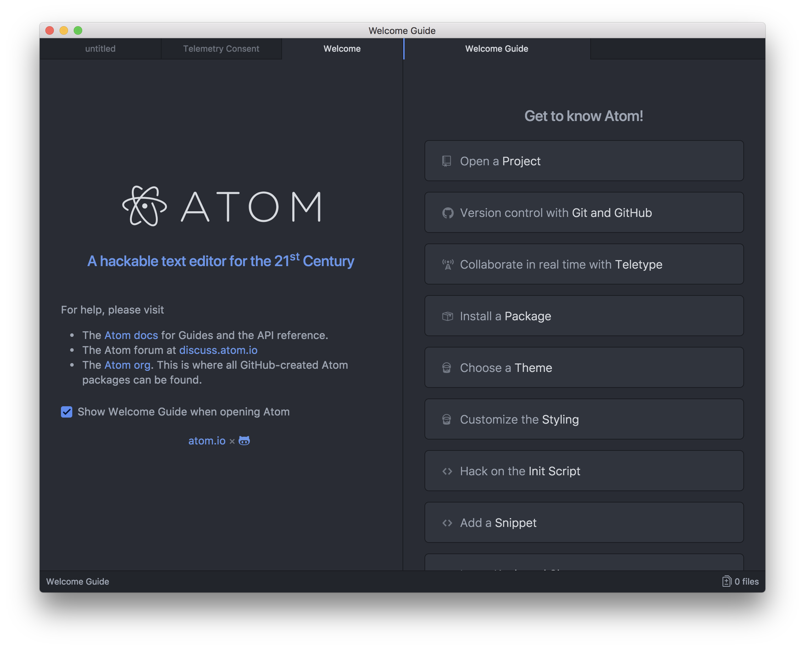
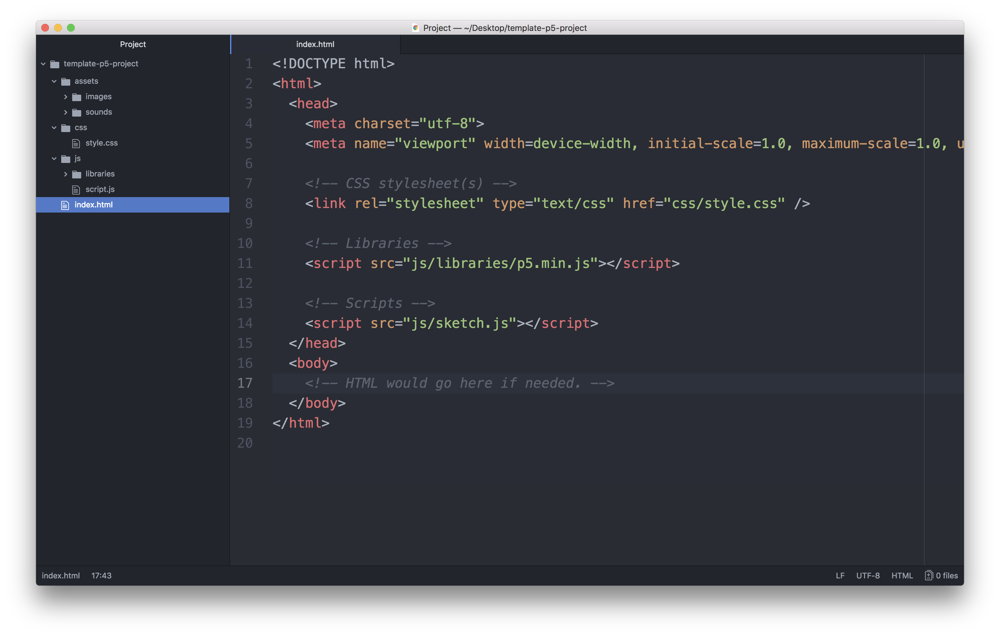

### Tools / CART 253 / Fall 2018 / Pippin Barr

# The tools of the trade

---

## In this module

- Atom
- Template project
- p5.js
- atom-live-server
- Chrome

---

## Atom

- Atom is a full-featured __text-editor__
- Therefore, at heart it's literally just a place to write text
- We will use it to write JavaScript code

---

## Atom

- __Launch Atom__
- There are various ways, use one you like
  - Find it in your Applications folder or in Program Files
  - It might be on the Dock at the bottom of your screen
  - Mac OS X: use Command+Space and type "Atom"
  - Windows: use Windows+S and type "Atom"

---

## Atom

- 

???

- As you can see, there are some default windows the first time you open Atom
- None of them are useful to us in our work, but unfortunately because of the way CDA runs the computers, you will likely see them every time you start Atom
- Get used to dismissing them

---

## Atom

- Close the Telemetry and Welcome tabs so you just have the `untitled` tab open
- Click in the text area and type some words
- That's called __text editing__!
--

- Programming is just fancy text editing with special words, right?

---

## Template project

- When we write JavaScript in this class there will be a basic structure of files and folders we will use every time
- Download the template project from the course website: https://pippinbarr.github.io/cart253-2018/templates/template-p5-project.zip
- Unzip it on your desktop (or wherever you like)
- You should now have a folder called `template-p5-project`
- You can see it has a bunch of files and folders in it

---

## Template project

- We want to open the template project in Atom, so
  - In Atom go to `File > Open...` and select the __folder__ called `template-p5-project` wherever you put it and choose `Open` (you want to select the __folder__, not a single file)
  - Or _drag_ the folder onto the Atom icon in the Dock at the bottom of your screen (Mac)
  - Or _drag_ the folder into the Atom window itself

???

- Technically, you __can__ also open one of the files in the main folder like `index.html`, which will open the entire project by default, __but__ this can get confusing if you already have another project open, so I wouldn't.

---

## Template project



???

- This is roughly what you should see when you open the template project
- In this case we have the `index.html` file selected in the project on the left
- Most importantly, you can see the contents of the file you are editing in the main __editing window__ (the biggest area)
- And you can see the file structure of the project in the left pane (the smaller, skinnier area with `index.html` selected)

---

## Template project

- Our standard template project has the following structure:

```
template-p5-project/
   css/
      style.css
   assets/
      images/
      sounds/
   js/
      libraries/
         p5.min.js
      script.js
   index.html
```

- Let's go over it

???

- At the top level we have `template-p5-project` - that's the folder that contains the total project
- Inside we have three folders called `css`, `assets`, and `js` (the forward slash is used to indicate a directory, but it isn't part of the name). These folders help to organise the files in our project.
- There's also a file at the top level called `index.html` which is the actual web-page that will be displayed when we run our project
- Inside `css` is `style.css` which controls the styling of the page - we won't worry much about this for a while
- Inside `assets` are two more folders, called `images` and `sounds`, which contain nothing, but we can imagine that we would put images and sounds in them!
- Inside `js` is a folder called `libraries` which contains the p5 library we're using in this course, the file for this is called `p5.min.js` - you can look at it, but it's pretty freaky
- Also inside `js` is our own script file called `script.js`

---

## `p5.min.js`

- In the `js/` folder is a folder called `libraries/` and in that folder is `p5.min.js`
- This file contains the __code for the p5 library__
- You can take a look at it, but it probably looks like nonsense
- Part of that is because of the `min` part of the name, it means __min__-ified which means it has been compressed and is not so readable anymore
- Notice that in `index.html`
  - there is a `<script>` tag that includes `p5.min.js` so that we can use it in our code in `script.js`
  - there is a `<script>` tag that includes `script.js` so that we can write our code in there and have it do things on the web page
- These two `<script>` tags are connecting the JavaScript to the HTML page being displayed

---

## atom-live-server

- Because we're using JavaScript, we will run our programs in a web browser
- To do this, we _could_ upload our project to a web server such as our user account at CDA, but this would get old fast when we're working
- Instead we will use a _package_ for Atom called atom-live-server
- Make sure a file in the project is selected on the left, probably `script.js` makes the most sense for us since that's what we'll usually be editing
- Go to `Packages > atom-live-server > Start server` (note the shortcut)

---

## Chrome


???

- Well, it _is_ only a template project!
- We don't see anything happening because our project doesn't actually do anything yet, but it _is_ actually running a bunch of code from p5.js already!

---

## atom-live-server is _live_

- The beauty of atom-live-server is not just that it loads our project when we ask
- It will also keep the version in the browser _up to date_ with what we do
- For now let's prove this by selecting the `index.html` file and writing some text inside the `<body></body>` tags, such as

```html
...
<body>
Hello, World!
</body>
...
```

- When we go back to Chrome, the page has updated!

---

## Summary

- We have a text-editor for our code (Atom)
- We have a template project to start from
- We have a JavaScript library to make visual programming easier (p5.js)
- We have a local server for testing our work (atom-live-server)
- We have a browser to view our work (Chrome)

Make friends with and come to love them all!

---

# Fin.
